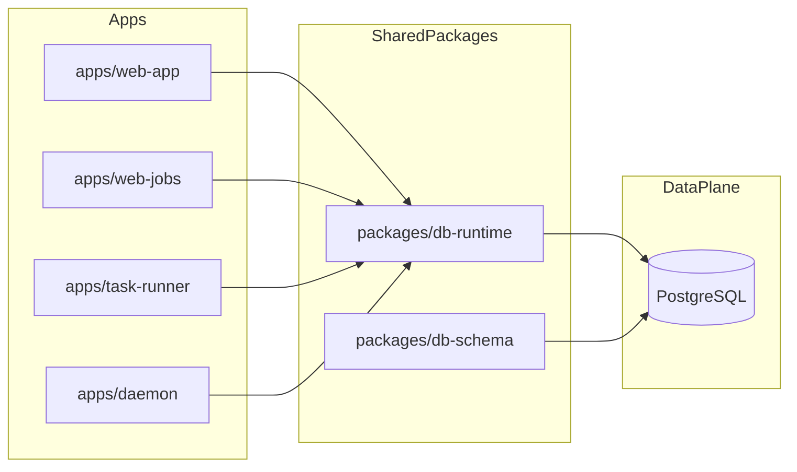

# PostgreSQL: Integration Plan

## Scope

Define a single, consistent PostgreSQL integration approach for this monorepo, covering runtime architecture, schema/migration flow, API data access patterns, observability, and reliability defaults.

## Decision

- Primary database technology: **PostgreSQL**
- No parallel database strategy is planned at this time.

## App boundary diagram

## Integration goals

1. Keep data access patterns consistent across `web-app`, `web-jobs`, and `task-runner`.
2. Avoid app-local ad hoc DB code by introducing shared runtime primitives.
3. Make schema evolution safe and auditable.
4. Ensure operational visibility (latency, errors, saturation, slow queries).

## Core principles (required)

### Shared runtime package: `packages/db-runtime`

Create a reusable package for connection lifecycle, transactions, retries, and query helpers.

Suggested responsibilities:

- pool/client creation and shutdown
- transaction wrappers (`withTransaction`)
- retry helpers for transient failures
- query timing + structured logging hooks
- health/readiness checks

Suggested exports:

- `createPostgresPool(config)`
- `withTransaction(pool, fn)`
- `query(pool, sql, params, options)`
- `isPostgresReady(pool)`
- `closePostgres(pool)`

### Standard environment contract

- `DATABASE_URL`
- `PGPOOL_MIN`
- `PGPOOL_MAX`
- `PG_QUERY_TIMEOUT_MS`
- `PG_IDLE_TIMEOUT_MS`
- `PG_SSL_MODE`

### Connection identity and ownership policy

Use explicit application identity in every connection and prefer isolated credentials per app.

- include an app name in the connection string or pool config (`application_name`)
- default application names to workspace app identifiers (`web-app`, `web-jobs`, `task-runner`, `daemon`)
- support per-app DB users/roles where operationally feasible (recommended)
- grant least-privilege permissions per app role (read/write scope, schema scope, migration scope)

Suggested env additions:

- `DB_APPLICATION_NAME`
- `DB_USER`
- `DB_PASSWORD`
- `DB_SCHEMA`

Example DSN style:

- `postgres://<user>:<pass>@<host>:5432/<db>?application_name=web-jobs`

### API/data contract alignment

- map DB errors to stable API error codes (do not expose raw SQL errors)
- preserve request correlation IDs through DB logs
- keep API payload schemas decoupled from table shape where possible

## Schema and migration strategy

1. Use migration files committed to source control.
2. Keep migrations forward-only in CI/CD; avoid destructive rollbacks in automation.
3. Require explicit index planning for read/write critical paths.
4. Add seed/fixture strategy for local and integration tests.

Recommended package path:

- `packages/db-schema` (Postgres migrations, seeds, schema helpers)

## Data access guidelines

### 1) Repository-style access modules

Each app should use data-access modules (or shared packages) rather than inline SQL in route handlers.

### 2) Transaction boundaries

- use explicit transactions for multi-write or read-modify-write flows
- avoid long-lived transactions in request handlers

### 3) Idempotency for async workflows

For queue-backed operations (`web-jobs`, `task-runner`):

- store idempotency keys/job IDs in DB where needed
- enforce unique constraints to prevent duplicate side effects

### 4) Concurrency and locking

- prefer optimistic patterns first
- use row-level locking only when contention requires it
- measure lock wait times and deadlock incidence

## App-level recommendations

### `apps/web-app`

- remain minimal; add only baseline data read/write examples
- use shared runtime package for all DB access

### `apps/web-jobs`

- persist job metadata/history in Postgres even when queue transport is Redis
- define retention and archival policy for completed/failed jobs

### `apps/task-runner`

- persist task definitions, run history, and progress snapshots
- use Postgres as source of truth for task state queried by API/UI

### `apps/daemon`

- use for maintenance tasks (cleanup, archival, reindex coordination) when needed

### `apps/hello-world`

- documentation-only example showing how to initialize `packages/db-runtime`

## Observability and operations

### Required metrics

- query latency (p50/p95/p99)
- error rate by SQLSTATE/class
- pool utilization/saturation
- connection failures and retry counts

### Logging requirements

- include `requestId`, `queryName`, duration, row count, and error class
- avoid logging full sensitive payloads/PII

### Health/readiness model

- `/health`: process liveness
- `/ready`: includes Postgres readiness check (`SELECT 1`) and pool health

## Security and compliance baseline

- enforce least-privilege DB roles per environment
- prefer dedicated DB users/roles per app to isolate blast radius and audit access
- require TLS/SSL according to environment policy
- store credentials in secret managers, not repository/env files
- validate backup/restore procedures and RPO/RTO expectations

## Testing strategy

1. Integration tests against disposable Postgres instances.
2. Migration tests in CI to catch drift early.
3. Contract tests for DB error mapping and transaction behavior.
4. Performance smoke tests for hot queries before release.

## Phased rollout

1. Introduce `packages/db-runtime` and env contract.
2. Add migration infrastructure (`packages/db-schema`).
3. Migrate `task-runner` task state to Postgres.
4. Migrate `web-jobs` history/state tracking to Postgres.
5. Add full observability dashboards and SLO alerts.
