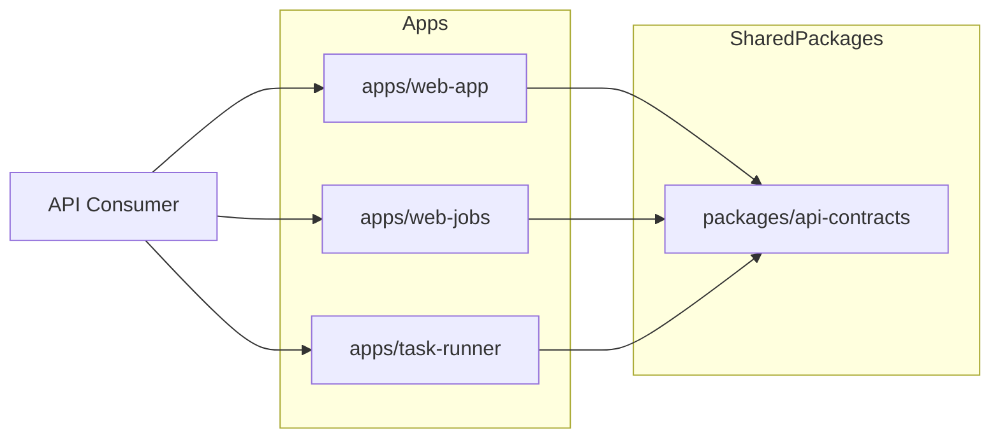

# API Design: Integration Plan

## Scope

Standardize API contracts across monorepo services (`web-app`, `web-jobs`, `task-runner`) so clients can rely on stable response shapes and error semantics.

## App boundary diagram

## Recommended API conventions

### 1) Versioning strategy

- start with path or header-based versioning (`/api/v1/...`)
- define compatibility expectations for additive vs breaking changes

### 2) Response envelope policy

Use consistent payload forms:

- success: resource-centric payload or list payload with metadata
- errors: canonical error object with code/message/requestId

### 3) Status code discipline

- `200` for reads
- `201` for creation
- `202` for accepted async processing
- `400/404/409/422` for client conditions
- `500` only for unhandled server faults

### 4) Async workflow schema

For queue-backed operations, unify fields:

- `jobId` or `taskId`
- `status`
- `acceptedAt`, `startedAt`, `completedAt`
- `attempt`, `lastError`, `progress`

### 5) Pagination and filtering

- stable query params: `limit`, `cursor`, `sort`, filters
- deterministic ordering guarantees

## Core principles required regardless of transport/framework

### Shared package: `packages/api-contracts`

Store reusable schemas and helpers.

Suggested exports:

- JSON schema/zod validators
- typed error catalog
- response builders (`ok`, `created`, `accepted`, `failure`)

### Documentation contract

- add endpoint docs near app READMEs
- maintain changelog entries for contract changes

## App-level recommendations

- `web-jobs`: align job endpoints to async envelope and clear retry metadata.
- `task-runner`: align task lifecycle payloads with queue status fields.
- `web-app`: remain minimal but model baseline contract and error format.
