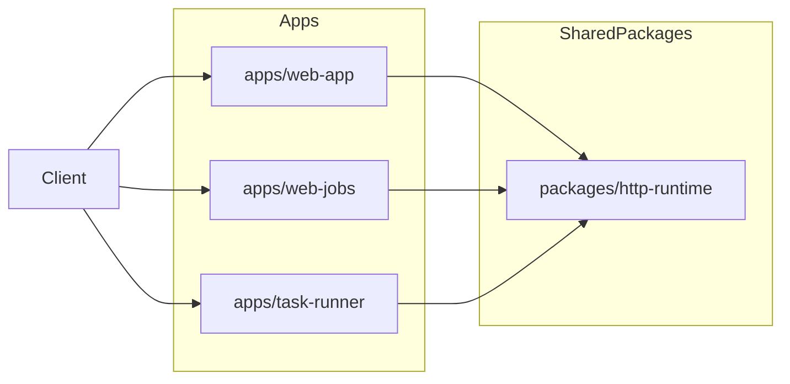

# HTTP Handling: Integration Plan

## Scope

Define a consistent HTTP handling model across `web-app`, `web-jobs`, and `task-runner` so request lifecycle behavior is predictable and production-safe.

## App boundary diagram



## Current repo fit

- `web-app` and `web-jobs` use native `node:http` handlers.
- `task-runner` uses native `node:http` with custom routing and static file serving.

## Recommended standards

### 1) Standard request lifecycle

Apply common lifecycle steps in every app:

1. request ID assignment
2. basic logging
3. route matching
4. input parsing + validation
5. handler execution
6. normalized success/error response

### 2) Operational defaults

- request timeout and body-size limits
- graceful shutdown that stops accepting new requests first
- explicit content-type behavior and method handling

### 3) Error response normalization

Adopt a common structure:

```json
{
  "error": {
    "code": "BAD_REQUEST",
    "message": "Human-readable message",
    "requestId": "..."
  }
}
```

### 4) Health/readiness split

- `/health`: process alive + shallow checks
- `/ready`: dependency readiness (Redis, external providers)

## Core principles required regardless of framework choice

### Shared runtime package: `packages/http-runtime`

Add reusable HTTP primitives to avoid app-local duplication.

Suggested exports:

- `createRequestContext(req)`
- `parseJsonBody(req, limits)`
- `sendJson(res, status, payload)`
- `sendError(res, err, context)`
- `setupHttpShutdown(server)`

### Environment contract

- `PORT`
- `HTTP_REQUEST_TIMEOUT_MS`
- `HTTP_BODY_LIMIT_BYTES`
- `HTTP_TRUST_PROXY`

## App-level recommendations

- `web-app`: become canonical minimal server pattern.
- `web-jobs`: keep enqueue API fast; delegate heavy work to queues.
- `task-runner`: move route parsing/response helpers into shared runtime.
