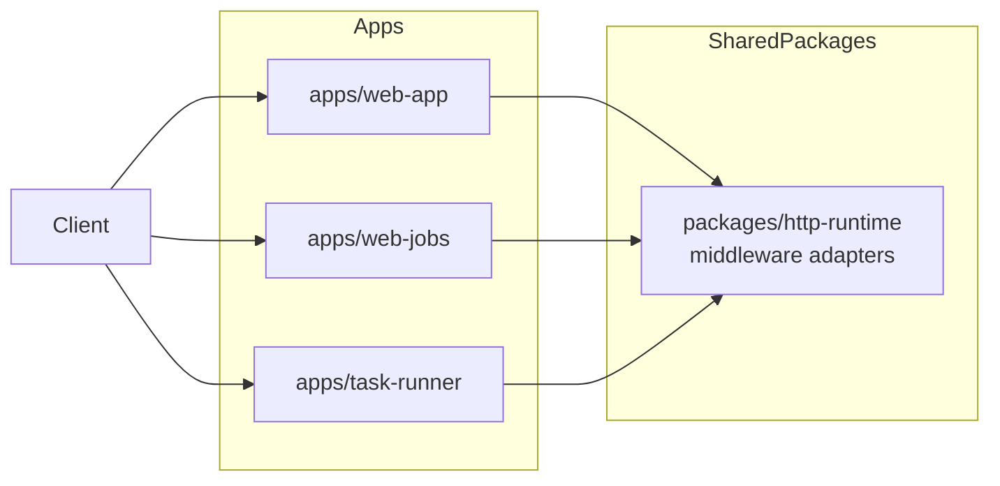

# Middleware: Integration Plan

## Scope

Define reusable middleware concerns for Node HTTP services in this monorepo.

## App boundary diagram

## Recommended middleware stack

Apply in this order:

1. request context (requestId, timestamp)
2. access logging
3. CORS policy
4. authn/authz (where needed)
5. rate limiting / abuse controls
6. body parsing + validation
7. route dispatch
8. error mapper

## Required capabilities

- request-scoped logging context
- input validation hooks
- consistent auth failure responses
- centralized exception-to-http mapping

## Core principles regardless of server framework

### Shared package: `packages/http-runtime`

Provide framework-agnostic middleware adapters.

Suggested exports:

- `withRequestContext(handler)`
- `withCors(handler, options)`
- `withAuth(handler, policy)`
- `withValidation(handler, schema)`
- `withErrorBoundary(handler)`

### Policy configuration

- environment-driven toggles for permissive vs strict behavior
- security defaults should be safe in production

## App-level recommendations

- `web-app`: include minimal baseline middleware chain.
- `web-jobs`: enforce strict input validation on job creation payloads.
- `task-runner`: harden task creation and run endpoints with validation + auth hooks.
