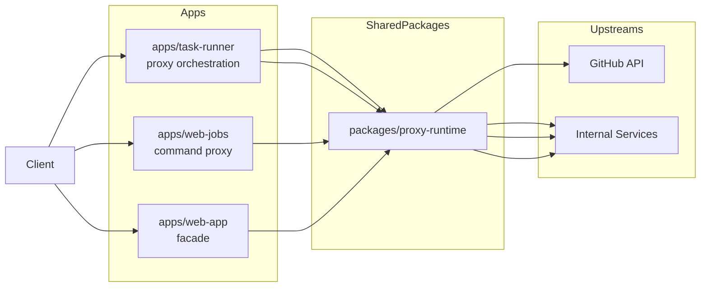

# Proxy Needs: Integration Plan

## Scope

Document proxy patterns for apps that mediate requests to background workers, external APIs (e.g., GitHub), and future internal services.

## App boundary diagram

## Proxy use cases in this repo

- `task-runner`: API/UI proxy for repository lookup and execution orchestration.
- `web-jobs`: command proxy for asynchronous work submission.
- `web-app`: potential lightweight façade for future upstream integrations.

## Recommended proxy standards

### 1) Explicit upstream contracts

- per-upstream timeout budgets
- retry policy by operation idempotency
- circuit-breaking or fail-fast behavior for unstable upstreams

### 2) Header propagation policy

- pass request correlation ID
- sanitize user-controlled headers
- avoid leaking internal implementation headers

### 3) Error translation policy

- translate upstream errors into stable local API codes
- preserve diagnostic context in logs, not client payloads

### 4) Security controls

- allowlist outbound domains where possible
- auth token scoping and secret handling by environment

## Core principles regardless of proxy library choice

### Shared package: `packages/proxy-runtime`

Suggested exports:

- `createUpstreamClient(config)`
- `proxyRequest(ctx, upstream, request)`
- `mapUpstreamError(err)`
- `withProxyObservability(handler)`

### Observability contract

- log `upstream`, latency, status, retries, and timeout events
- emit metrics for error class and saturation

## App-level recommendations

- `task-runner`: formalize GitHub proxy contract (timeouts, retries, rate-limit handling).
- `web-jobs`: keep proxy surface thin and queue-first for heavy work.
- `web-app`: use as a constrained façade, not a pass-through tunnel.
