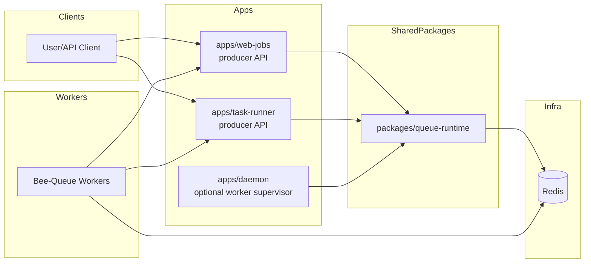

# Bee-Queue: Evaluation and Integration Plan

## Current release snapshot

- **Latest npm release:** `2.0.0`
- **Focus:** lean Redis queueing for short-lived, real-time distributed jobs
- **Core tradeoff:** simplicity and low overhead over broad orchestration features

## App boundary diagram

## Where Bee-Queue fits best in this repo

Bee-Queue is a strong fit when we want:

- low-complexity producer/worker queueing
- at-least-once delivery with stalled job recovery
- retries/backoff and delayed jobs without workflow/DAG complexity

Best first targets in this monorepo:

1. `apps/web-jobs` (replace in-memory queue)
2. `apps/task-runner` (replace simulated execution loop with queue-backed execution)

## Bee-Queue implementation best practices

### 1) Split producer and worker roles

- API/service nodes: `isWorker: false`, `getEvents: false` unless explicitly needed
- Worker nodes: `isWorker: true`, `queue.process(concurrency, handler)`

### 2) Apply per-job reliability defaults

- `retries(n)`
- `.backoff('fixed'|'exponential', delay)`
- `.timeout(ms)`

### 3) Run stalled checks from limited instances

Use `checkStalledJobs(interval)` in one or a small fixed worker subset, not all instances.

### 4) Design idempotency and retention upfront

- use `.setId(externalId)` where dedupe is required
- configure `removeOnSuccess/removeOnFailure` by workload profile

### 5) Optimize bulk enqueue paths

Use `queue.saveAll([...])` for burst API requests.

### 6) Graceful shutdown in workers

On SIGTERM/SIGINT:

1. stop intake
2. `await queue.close(timeout)`
3. exit

### 7) Expose queue health

Add queue telemetry to `/health` or `/info`:

- waiting/active/succeeded/failed/delayed
- retry/stall counters
- enqueue/dequeue rates

## Core principles required regardless of queue technology

These principles should be implemented even if we keep Bee-Queue, migrate to BullMQ, or support both.

### Shared runtime package: `packages/queue-runtime`

Create a shared package for queue bootstrap + policy enforcement so each app does not reinvent queue setup.

Suggested exports:

- `createProducerQueue(...)`
- `createWorkerQueue(...)`
- `applyJobPolicy(job, profile)`
- `registerHandlers(queue, handlerMap)`
- `createQueueHealthSnapshot(queue)`
- `setupQueueShutdown(queue)`

### Standard environment contract

- `REDIS_URL`
- `QUEUE_PREFIX`
- `QUEUE_ROLE`
- `QUEUE_CONCURRENCY`
- `QUEUE_STALL_INTERVAL_MS`

### Unified API contract for async operations

- enqueue response: `{ jobId, status, acceptedAt }`
- status response: includes attempts, timestamps, last error, progress

## App-level integration recommendations (Bee-Queue)

### `apps/web-jobs`

- Replace `jobQueue`/`jobResults` in-memory structures with Bee-Queue-backed storage
- Keep REST surface, but enqueue instead of local push/process
- Add dedicated worker mode and health metrics

### `apps/task-runner`

- Replace timer-based `simulateTaskExecution` path with queued execution jobs
- Keep `/api/tasks/:id/progress` but source progress from queue events + persisted task state

### `apps/daemon`

- Optional worker-supervisor mode for queue processors and stall checks

### `apps/web-app`

- Producer-only queue usage for non-critical async side effects

### `apps/hello-world`

- Keep minimal; provide queue-ready snippet in docs only
