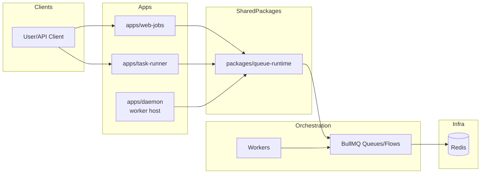

# BullMQ: Evaluation and Integration Plan

## Current release snapshot

- **Latest npm release:** `5.68.0`
- **Focus:** Redis queueing with rich orchestration features and broad ecosystem usage
- **Core tradeoff:** more capabilities and flexibility at the cost of extra operational/conceptual complexity

## App boundary diagram

## Where BullMQ fits best in this repo

BullMQ is a strong fit when we need:

- complex workflows/flows (DAG-like dependencies)
- richer scheduling patterns and repeatability
- more advanced queue control semantics than a minimal queue runtime

Recommended use in this monorepo:

- adopt selectively for queues that truly need orchestration depth
- do not force all apps onto BullMQ if Bee-Queue-level simplicity is sufficient

## BullMQ implementation best practices

### 1) Separate API enqueue from worker execution

- API nodes should enqueue only
- dedicated worker nodes should process jobs with controlled concurrency

### 2) Keep queue naming + prefix strategy stable

- environment-scoped prefixes
- predictable queue names per bounded context (`web-jobs.default`, `task-runner.exec`)

### 3) Enforce per-job policies

- retries/backoff/timeouts
- explicit failure handling and dead-letter strategy where needed

### 4) Build for idempotency

- deterministic job IDs where duplicate submissions are possible
- idempotent handlers for external side effects

### 5) Operational safety defaults

- graceful worker shutdown
- health endpoints with queue counters and lag visibility
- structured logs with queue/job/attempt/duration metadata

### 6) Test contract + failure paths

- integration tests with disposable Redis
- retry and timeout scenario tests
- malformed payload and handler exception tests

## Core principles required regardless of queue technology

Even if BullMQ is selected (or mixed with Bee-Queue), enforce these baseline principles.

### Shared runtime package: `packages/queue-runtime`

Build a queue abstraction package to keep app code consistent and minimize lock-in.

Suggested responsibilities:

- queue client creation/config
- producer/worker bootstrap
- shared job policy profiles
- health snapshot adapters
- shutdown helpers
- observability hooks

### Standard environment contract

- `REDIS_URL`
- `QUEUE_PREFIX`
- `QUEUE_ROLE`
- `QUEUE_CONCURRENCY`
- queue-system-specific tuning vars (e.g., retry/backoff defaults)

### Unified async API contract

- enqueue response shape and status schema must remain stable across app boundaries
- app APIs should not leak raw queue-library implementation details

## App-level integration recommendations (BullMQ)

### `apps/web-jobs`

- If requirements stay simple, Bee-Queue is enough
- If roadmap adds multi-step workflows/scheduling semantics, BullMQ is a good upgrade path

### `apps/task-runner`

- Better candidate for BullMQ when task execution evolves into multi-stage pipelines
- flow-based orchestration can model clone/build/run/report pipelines cleanly

### `apps/daemon`

- host specialized workers, scheduled maintenance jobs, and health/reporting loops

### `apps/web-app`

- keep producer-focused; avoid embedding heavy processing in API path

### `apps/hello-world`

- documentation-only queue-ready extension pattern
